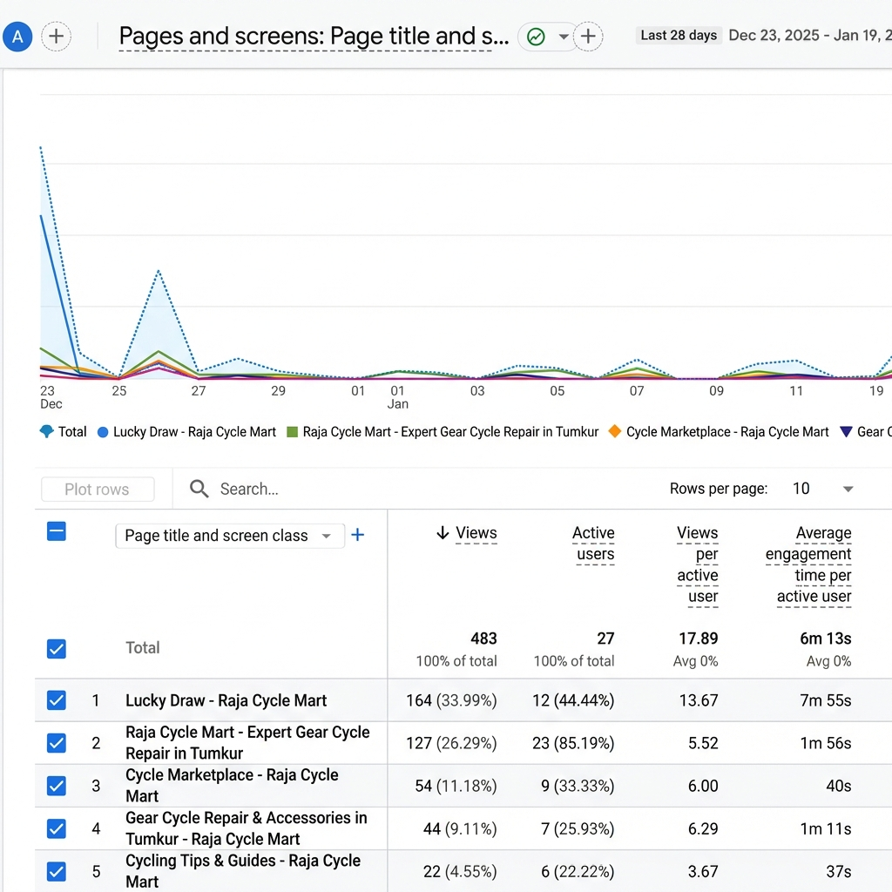

# Raja Cycle Mart 🚲 (Digital Transformation)

[](https://firebase.google.com/)
[](https://vercel.com/)
[](LICENSE)
[]()

> **The actual code behind the "Digitize or Die" Case Study.**
>
> How I turned a 1987 cycle shop into a tech-powered business using **Serverless** tools for ₹0/month.

 

---

## 🎯 The Goal
Most local businesses can't afford ₹50,000 for custom software. This project proves you can build a **Fortune 500-level digital ecosystem** for free using the right stack.

**Live Site:** [https://raja-cycle-mart.vercel.app](https://raja-cycle-mart.vercel.app)

---

## ✨ Key Features

### 1. 🎰 Gamified "Lucky Draw" Engine
*   **The Hook:** Customers enter phone/email to win a cycle.
*   **The Tech:**
    *   **No backend:** Writes directly to Firestore.
    *   **Anti-Spam:** OTP verification via **EmailJS** (Free Tier).
    *   **Real-time:** Live "Recent Entries" ticker updates via Firestore listeners.

### 2. 🤖 Telegram Booking Bot
*   When a customer books a service, the owner gets an **Instant Telegram Notification**.
*   Skipped the ₹1000/month SMS gateway by using the Telegram API (Free).

### 3. 🛍️ Affiliate Marketplace
*   "Passive Revenue" page featuring top accessories from Amazon.
*   Uses a simple CSS Grid layout optimized for mobile sales.

### 4. ⚡ 95+ Mobile Score
*   Hand-coded HTML/CSS (No heavy frameworks like React/Next.js).
*   Inline SVGs (No font libraries).
*   WebP images.

---

## 🛠️ Tech Stack

| Component | Technology | Why? | cost |
|:---|:---|:---|:---|
| **Frontend** | Vanilla HTML5, CSS3, JS | Blazing fast, runs on any phone. | ₹0 |
| **Database** | Firebase Firestore | Real-time, scalable NoSQL. | ₹0 |
| **Auth/OTP** | EmailJS | Validates users without a server. | ₹0 |
| **Hosting** | Vercel | Global CDN, instant deploys. | ₹0 |
| **Notifications** | Telegram Bot API | Instant alerts for the owner. | ₹0 |

---

## 🚀 Quick Setup (Run it locally)

1.  **Clone the repo**
    ```bash
    git clone https://github.com/sumanthgn-cloud/raja-cycle-mart.git
    cd raja-cycle-mart
    ```

2.  **Configure Firebase**
    *   Go to [Firebase Console](https://console.firebase.google.com/).
    *   Create a new project.
    *   Enable **Firestore Database**.
    *   Copy your config object.

3.  **Add API Keys**
    Create a `config.js` file (or update the existing script tag):
    ```javascript
    const firebaseConfig = {
      apiKey: "YOUR_API_KEY",
      authDomain: "YOUR_PROJECT.firebaseapp.com",
      projectId: "YOUR_PROJECT_ID",
      storageBucket: "YOUR_PROJECT.appspot.com",
      messagingSenderId: "...",
      appId: "..."
    };
    ```

4.  **Launch**
    Just open `index.html` in your browser! (Or use Live Server extension).

---

## 🔐 Security Rules (Important!)
Since we use Firebase validation on the client, you **MUST** set strict Firestore rules to prevent tampering:

```javascript
// firestore.rules
rules_version = '2';
service cloud.firestore {
  match /databases/{database}/documents {
    match /lucky_entries/{entry} {
      allow create: if request.resource.data.phone.size() == 10;
      allow read: if true; 
    }
  }
}
```

---

## 🤝 Contributing
Feel free to fork this and adapt it for your local grocery store, mechanic, or salon! 

1.  Fork it
2.  Create your feature branch (`git checkout -b feature/cool-new-thing`)
3.  Commit your changes (`git commit -m 'Add some cool new thing'`)
4.  Push to the branch (`git push origin feature/cool-new-thing`)
5.  Create a Pull Request

---

## 📄 License
**MIT License** - You can steal this code, modify it, and sell it to 100 other clients. Go get paid! 💸
